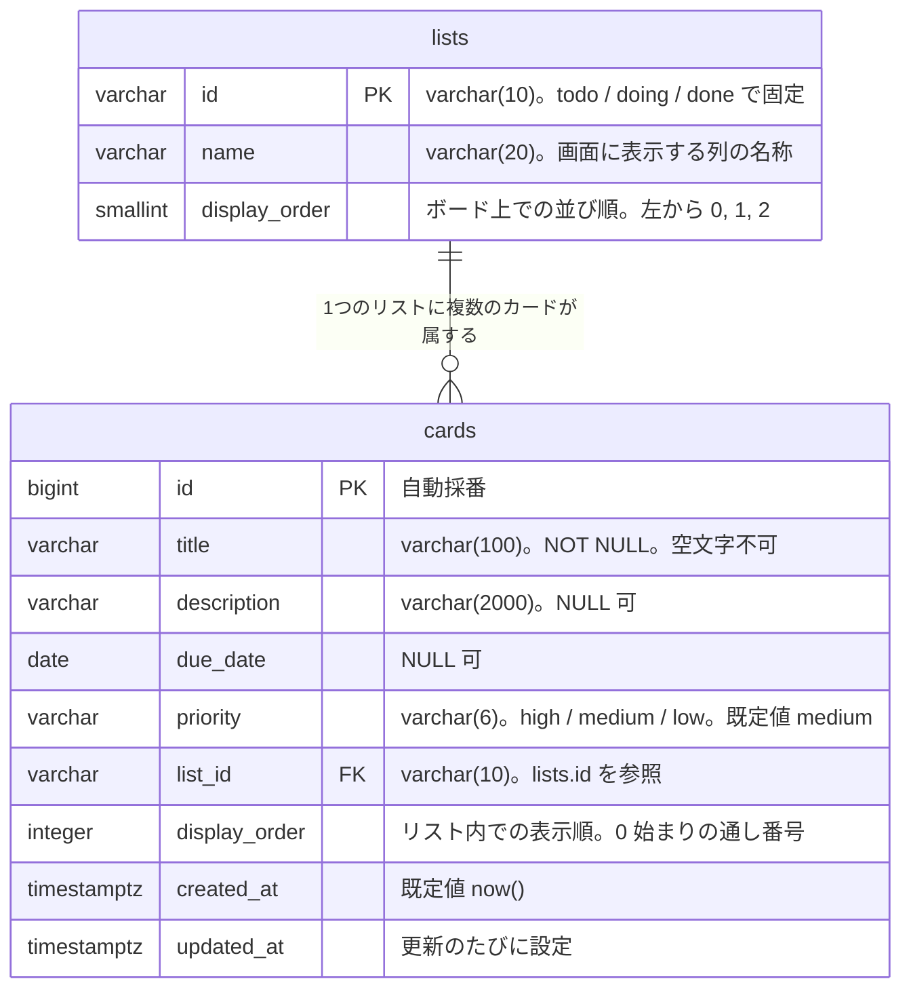

# タスク管理アプリ データ設計書

## 1. 文書情報

| 項目 | 内容 |
| --- | --- |
| 文書名 | タスク管理アプリ データ設計書 |
| 版数 | 1.2 |
| 作成日 | 2026-09-19 |
| 最終更新日 | 2026-09-20 |
| 作成者 | KeiT0773 |
| ステータス | 確定 |
| 上位文書 | [データ要件書](data-requirements.md) |
| 関連文書 | [要件定義書](requirements.md)、[機能要件書](functional-requirements.md)、[画面要件書](screen-requirements.md)、[技術スタック](tech-stack.md) |
| 下位文書 | [API 設計書](api-design.md) |

本書は、[データ要件書](data-requirements.md) が「基本設計で決定する」として保留した **具体的な格納形式**（テーブル定義、データ型、桁数、制約、初期データ）と、それをデータベースへ反映する手順（マイグレーション方針）を定義する。

データベース製品は [技術スタック](tech-stack.md) 5. のとおり **PostgreSQL 16 系** とし、本書の記述はすべて PostgreSQL の構文に従う。

本書が扱う範囲と、扱わない範囲は次のとおり。

| 範囲 | 扱い | 定義する文書 |
| --- | --- | --- |
| テーブル定義、制約、インデックス、初期データ、マイグレーション | 本書で定義する | 本書 |
| Java のエンティティクラスとテーブルの対応づけ（JPA） | 本書では扱わない | 別途作成する |
| REST API の一覧、要求・応答の形式 | 本書では扱わない | [API 設計書](api-design.md) |

### 1.1 変更履歴

| 版数 | 日付 | 変更内容 | 変更者 |
| --- | --- | --- | --- |
| 1.0 | 2026-09-19 | 初版作成。データ要件書 v1.1 をもとに、テーブル定義・制約・初期データ・Flyway 方針を確定 | KeiT0773 |
| 1.1 | 2026-09-20 | [API 設計書](api-design.md) を作成したことに伴い、文書情報に下位文書へのリンクを追加し、12. 保留事項から REST API の項目を除外 | KeiT0773 |
| 1.2 | 2026-09-20 | 取得 API の動作確認用に、画面モックと同じサンプルカード 6 件を `V3` で投入することを 7.・10.2 に追記。本番配置時の扱いを 12. 保留事項に追加 | KeiT0773 |

---

## 2. 設計方針

本書全体を通じて適用する方針を、先に示す。

| No | 方針 | 理由 |
| --- | --- | --- |
| 1 | テーブル名・カラム名は英小文字の snake_case（単語を `_` でつなぐ）で付ける。テーブル名は複数形とする | PostgreSQL と Spring Data JPA の双方で最も一般的な書き方であり、参照できる資料が多い |
| 2 | テーブルの作成・変更は Flyway だけが行う。JPA には一切テーブルを作らせない | どの時点でどの定義になっているかを SQL ファイルの履歴として追えるようにするため。設定は [application.properties](../backend/src/main/resources/application.properties) の `spring.jpa.hibernate.ddl-auto=none` で既に有効 |
| 3 | カードの削除は物理削除とする（行を実際に消す） | 削除の取り消しは提供しない（[機能要件書](functional-requirements.md) FR-03、[要件定義書](requirements.md) 8. 制約事項）ため、削除済みフラグを持つ必要がない |
| 4 | 「値が無い」状態は `NULL` で表し、空文字（`''`）は保存しない | 未入力の表し方が2通りあると、検索条件や画面表示の分岐が二重になる。入口（バックエンド）で空文字を `NULL` に変換して統一する |
| 5 | 業務上のルールのうち、DB だけで確実に守れるものは制約として書く | バックエンドの検証（Bean Validation）に不具合があっても、誤ったデータが保存されるのを防げる。検証は「二重にかける」ことを前提とする |
| 6 | 利用者は1名で、同時編集は想定しない（[要件定義書](requirements.md) 5.1）ため、排他制御用の列（バージョン番号など）は設けない | 本バージョンでは不要。必要になった時点で追加する（8. 保留事項） |

---

## 3. テーブル一覧

[データ要件書](data-requirements.md) 4. の ER 図に示した2つのエンティティを、そのまま2つのテーブルとして定義する。

| 物理名 | 論理名 | 内容 | 想定件数 |
| --- | --- | --- | --- |
| `lists` | リスト（列） | ボード上の列。「未着手 / 作業中 / 完了」の3件で固定し、利用者は追加・削除・変更できない | 3件（固定） |
| `cards` | カード | 利用者が登録するタスク1件 | 最大100件程度（[要件定義書](requirements.md) 5.1） |

---

## 4. テーブル定義

### 4.1 `lists`（リスト）

| # | カラム名 | 型 | NULL | 既定値 | 説明 | データ要件書の対応項目 |
| --- | --- | --- | --- | --- | --- | --- |
| 1 | `id` | `varchar(10)` | 不可 | ― | 主キー。`todo` / `doing` / `done` の3値で固定 | 識別子 |
| 2 | `name` | `varchar(20)` | 不可 | ― | 画面に表示する列の名称（未着手 / 作業中 / 完了） | リストの表示名 |
| 3 | `display_order` | `smallint` | 不可 | ― | ボード上での並び順。左から 0, 1, 2 | ボード上での並び順 |

`id` を連番ではなく `todo` のような意味のある文字列にしているのは、リストが3件で固定であり（[要件定義書](requirements.md) 決定事項 No.1）、値そのものを見れば何の列か分かる方がログや API のやり取りを追いやすいためである。画面モック（`mock/script.js`）でも同じ値を使っている。

```sql
CREATE TABLE lists (
    id            varchar(10) NOT NULL,
    name          varchar(20) NOT NULL,
    display_order smallint    NOT NULL,
    CONSTRAINT pk_lists PRIMARY KEY (id)
);

COMMENT ON TABLE  lists               IS 'リスト（列）。未着手 / 作業中 / 完了 の3件で固定';
COMMENT ON COLUMN lists.id            IS '識別子。todo / doing / done';
COMMENT ON COLUMN lists.name          IS '画面に表示する列の名称';
COMMENT ON COLUMN lists.display_order IS 'ボード上での並び順。左から 0, 1, 2';
```

### 4.2 `cards`（カード）

| # | カラム名 | 型 | NULL | 既定値 | 説明 | データ要件書の対応項目 |
| --- | --- | --- | --- | --- | --- | --- |
| 1 | `id` | `bigint` | 不可 | 自動採番 | 主キー。登録時に DB が 1, 2, 3... と採番する | 識別子 |
| 2 | `title` | `varchar(100)` | 不可 | ― | カード上に表示するタスク名。空文字・空白のみは不可 | タイトル |
| 3 | `description` | `varchar(2000)` | 可 | `NULL` | タスクの補足説明。改行を含む複数行を許容する | 説明文 |
| 4 | `due_date` | `date` | 可 | `NULL` | 完了すべき日付。時刻は持たない | 期限 |
| 5 | `priority` | `varchar(6)` | 不可 | `'medium'` | 優先度。`high` / `medium` / `low` のいずれか | 優先度 |
| 6 | `list_id` | `varchar(10)` | 不可 | ― | 所属リスト。`lists.id` を参照する外部キー | 所属リスト |
| 7 | `display_order` | `integer` | 不可 | ― | 同じリスト内での表示順。0 から始まる通し番号 | 表示順 |
| 8 | `created_at` | `timestamptz` | 不可 | `now()` | カードが登録された日時 | 作成日時 |
| 9 | `updated_at` | `timestamptz` | 不可 | `now()` | カードが最後に変更された日時 | 更新日時 |

```sql
CREATE TABLE cards (
    id            bigint        NOT NULL GENERATED ALWAYS AS IDENTITY,
    title         varchar(100)  NOT NULL,
    description   varchar(2000),
    due_date      date,
    priority      varchar(6)    NOT NULL DEFAULT 'medium',
    list_id       varchar(10)   NOT NULL,
    display_order integer       NOT NULL,
    created_at    timestamptz   NOT NULL DEFAULT now(),
    updated_at    timestamptz   NOT NULL DEFAULT now(),
    CONSTRAINT pk_cards            PRIMARY KEY (id),
    CONSTRAINT fk_cards_list       FOREIGN KEY (list_id) REFERENCES lists (id)
                                       ON UPDATE CASCADE ON DELETE RESTRICT,
    CONSTRAINT ck_cards_title      CHECK (length(btrim(title)) > 0),
    CONSTRAINT ck_cards_priority   CHECK (priority IN ('high', 'medium', 'low')),
    CONSTRAINT ck_cards_disp_order CHECK (display_order >= 0)
);

CREATE INDEX ix_cards_list_display_order ON cards (list_id, display_order);

COMMENT ON TABLE  cards               IS 'カード。利用者が登録するタスク1件';
COMMENT ON COLUMN cards.title         IS 'タスク名。空文字・空白のみは不可（FR-01）';
COMMENT ON COLUMN cards.description   IS '補足説明。未入力は NULL（FR-06）';
COMMENT ON COLUMN cards.due_date      IS '期限。未設定は NULL（FR-07）';
COMMENT ON COLUMN cards.priority      IS '優先度。high / medium / low（FR-08）';
COMMENT ON COLUMN cards.list_id       IS '所属リスト。lists.id を参照（FR-04）';
COMMENT ON COLUMN cards.display_order IS 'リスト内での表示順。0 から始まる通し番号（FR-05）';
```

#### 型と桁数を選んだ理由

| カラム | 決定 | 理由 |
| --- | --- | --- |
| `id` | `bigint` の自動採番（`GENERATED ALWAYS AS IDENTITY`） | 利用者1名・単一サーバーのため UUID のような重複回避の仕組みは不要。目で追いやすい連番が扱いやすい。`GENERATED ALWAYS` は値の直接指定を禁じる書き方で、採番を DB に一本化できる |
| `title` | `varchar(100)` | カード表面に1〜2行で収まる長さ。画面モックで扱っている文字数（10文字前後）に対して十分な余裕がある |
| `description` | `varchar(2000)` | 原稿用紙5枚分程度。補足メモの用途には十分で、上限を決めておくと画面の入力欄にも同じ制限をかけられる。`text` 型（上限なし）も選べるが、際限なく書ける欄は入力チェックの基準を作りにくいため上限を設ける |
| `due_date` | `date` | 期限は「日付」であり時刻を持たない（[機能要件書](functional-requirements.md) FR-07）。`timestamp` にすると 0 時 0 分という意味のない時刻を保持することになる |
| `priority` | `varchar(6)` | `high` / `medium` / `low` の最長が6文字。PostgreSQL の `ENUM` 型も選べるが、値を増やすときに型そのものの変更が必要になり、JPA との対応づけも一手間増えるため、文字列と `CHECK` 制約の組み合わせにする |
| `created_at`・`updated_at` | `timestamptz` | 5. の「日時の扱い」を参照 |

---

## 5. 制約・インデックス

### 5.1 一覧

| 種別 | 名前 | 対象 | 内容 | 根拠 |
| --- | --- | --- | --- | --- |
| 主キー | `pk_lists` | `lists (id)` | リストを一意に識別する | データ要件書 4. |
| 主キー | `pk_cards` | `cards (id)` | カードを一意に識別する | データ要件書 4. |
| 外部キー | `fk_cards_list` | `cards (list_id)` → `lists (id)` | カードは必ずいずれか1つのリストに属する | データ要件書 4. |
| 検査 | `ck_cards_title` | `cards (title)` | 前後の空白を除いて1文字以上 | FR-01 |
| 検査 | `ck_cards_priority` | `cards (priority)` | `high` / `medium` / `low` のいずれか | FR-08、決定事項 No.2 |
| 検査 | `ck_cards_disp_order` | `cards (display_order)` | 0 以上 | 6. の運用規則 |
| 索引 | `ix_cards_list_display_order` | `cards (list_id, display_order)` | リストごとに表示順で取り出すための索引 | SC-01 のボード表示 |

### 5.2 外部キーの削除・更新時の動作

`fk_cards_list` には `ON DELETE RESTRICT`（参照されているリストは削除できない）と `ON UPDATE CASCADE`（リストの `id` を変えたらカード側も追随する）を指定する。

リストは3件で固定であり、そもそも削除も `id` の変更も行わない（[要件定義書](requirements.md) 決定事項 No.1）。したがってこれらは通常発生しないが、誤操作や将来の改修でリストを消そうとしたときに、カードだけが宙に浮く状態を DB が拒否するようにしておく。

### 5.3 `(list_id, display_order)` に一意制約を付けない理由

「同じリスト内で表示順が重複しない」ことは業務上は常に成り立つが、一意制約としては定義しない。

6. のとおり表示順は並べ替えのたびに 0 から振り直す。その UPDATE を1行ずつ実行する過程では、一時的に同じ値のカードが2枚存在する瞬間がある。通常の一意制約はこの途中経過を拒否してしまう。

PostgreSQL には制約の判定をトランザクションの終わりまで遅らせる書き方（`DEFERRABLE INITIALLY DEFERRED`）があり、これを使えば一意制約と振り直しを両立できる。ただし「制約はあるが即座には効かない」という例外的な挙動を1か所だけ持ち込むことになり、構成を単純に保つ方針（[技術スタック](tech-stack.md) 2.）に反する。表示順の一意性はバックエンド側の振り直し処理で担保し、DB には検索用の索引 `ix_cards_list_display_order` のみを置く。

### 5.4 日時の扱い

| 事項 | 決定 |
| --- | --- |
| 型 | `timestamptz`（タイムゾーン付きの日時）。PostgreSQL は内部で UTC として保管し、取り出すときに指定のタイムゾーンへ変換する |
| 設定するタイミング | `created_at` は登録時のみ。`updated_at` は登録・編集・移動・並べ替えのたびにバックエンドが現在時刻を設定する |
| 画面での表示 | 日本時間（`Asia/Tokyo`）に変換して表示する。本バージョンでは画面に日時を表示しないため、当面は保存のみ |

`compose.yaml` のコンテナに `TZ: Asia/Tokyo` を指定しているが、これはコンテナのログなどの表示に使われる設定であり、`timestamptz` の保存値そのものには影響しない。保存値は常に UTC 基準で、どのタイムゾーンの環境から読んでも同じ時点を指す。

**期限超過の判定基準**：[要件定義書](requirements.md) 11.1（FR-07）で「判定基準は基本設計で定める」とした点を、ここで次のとおり定める。

> 日本時間での「今日」の日付が `due_date` より後であるカードを、期限超過として扱う。

期限当日は超過とみなさない。判定は表示のたびにフロントエンドで行い、判定結果を DB に保存することはしない（日付が変われば結果も変わるため、保存すると古い判定が残る）。

---

## 6. 表示順（`display_order`）の運用規則

`cards.display_order` は「同じリスト内で、上から数えて何番目か」を表す 0 始まりの通し番号である。あるリストにカードが n 枚あるとき、その値は必ず 0, 1, 2, ..., n-1 が1つずつ揃った状態になる。

| 事項 | 規則 |
| --- | --- |
| 値の範囲 | 0 以上の連続した整数。欠番も重複も作らない |
| 比較の範囲 | 同じ `list_id` の中だけで意味を持つ。別のリストのカードと大小を比べることはない |
| 振り直しを行う操作 | カードの登録（FR-01）、削除（FR-03）、リスト間の移動（FR-04）、リスト内の並べ替え（FR-05）、優先度の変更（FR-08） |
| 振り直しの単位 | 影響を受けたリストのカード全件。リスト間の移動では、移動元と移動先の2つのリストが対象になる |
| 実行の単位 | 1回の操作で生じる振り直しを、1つのトランザクションにまとめて実行する。途中で失敗した場合は操作前の状態に戻す |
| 取得時の並び | ボード画面へ返すカードは `ORDER BY list_id, display_order` で取り出す。索引 `ix_cards_list_display_order` がこの並びに対応する |

**なぜ毎回振り直すのか**：10, 20, 30 のように間隔を空けておき、間に差し込むときだけ中間値（15 など）を書き込む方法もある。更新するのが1行で済む反面、隙間が尽きたときに全体を振り直す処理が別途必要になり、規則が2つに増える。カードは最大100件程度（[要件定義書](requirements.md) 5.1）であり、100行の UPDATE は一瞬で終わるため、規則が1つで済む「毎回振り直す」方式を採る。

優先度順に並べ直す規則そのもの（高 → 中 → 低、同じ優先度の中では既存の順序を保つ、操作したカードはそのグループの末尾）は [機能要件書](functional-requirements.md) 3.1 に定義されている。バックエンドはその規則に従って新しい並びを決め、その結果を 0 からの通し番号として書き込む。

---

## 7. 初期データ

`lists` の3件は、アプリの動作に必ず存在していなければならないデータである。利用者が登録するものではないため、マイグレーションの一部として投入する。

| `id` | `name` | `display_order` |
| --- | --- | --- |
| `todo` | 未着手 | 0 |
| `doing` | 作業中 | 1 |
| `done` | 完了 | 2 |

```sql
INSERT INTO lists (id, name, display_order) VALUES
    ('todo',  '未着手', 0),
    ('doing', '作業中', 1),
    ('done',  '完了',   2);
```

`cards` には業務上の初期データは無い。ただし開発中に取得 API や画面の動作を確認できるよう、画面モック（`mock/script.js`）と同じ 6 件のサンプルカードを `V3__insert_sample_cards.sql` で投入する。

| `title` | `description` | `due_date` | `priority` | `list_id` | `display_order` |
| --- | --- | --- | --- | --- | --- |
| 資料作成 | 来週の定例会議で使う資料。（2 行） | 適用日 + 2 日 | `high` | `todo` | 0 |
| 買い物 | 牛乳、卵、パン | 適用日 − 3 日 | `medium` | `todo` | 1 |
| 読書 | `NULL` | `NULL` | `low` | `todo` | 2 |
| 実装 | ログイン画面のバリデーションを追加する | 適用日 + 7 日 | `medium` | `doing` | 0 |
| 掃除 | `NULL` | `NULL` | `low` | `done` | 0 |
| 返信 | 田中さんへのメール返信 | 適用日 − 2 日 | `medium` | `done` | 1 |

期限は `current_date` を基準にした相対日付で書き、適用した日に関係なく期限切れの例（買い物・返信）が含まれるようにしている。`id` は `GENERATED ALWAYS` のため指定せず、DB の採番に任せる。

このサンプルデータはバージョン付きマイグレーションのため、本番環境にも適用されてしまう。本番配置時にどう除外するかは 12. 保留事項に記載する。

---

## 8. 物理 ER 図

[データ要件書](data-requirements.md) 4. の ER 図を、本書で確定した物理名・型に置き換えたもの。



- `||--o{` は「`lists` 1件に対して `cards` が 0件以上」を表す。カードが1枚もないリストも存在しうる。
- `PK` は主キー、`FK` は外部キーを示す。

---

## 9. 論理名と物理名の対応

[データ要件書](data-requirements.md) 2. に定義された9つの項目が、どのカラムに対応するかを示す。要件書と本書を読み比べるときはこの表を参照する。

| データ要件書の項目 | テーブル | カラム | 型 | 備考 |
| --- | --- | --- | --- | --- |
| 識別子 | `cards` | `id` | `bigint` | 登録時に DB が採番 |
| タイトル | `cards` | `title` | `varchar(100)` | 必須。空文字不可 |
| 説明文 | `cards` | `description` | `varchar(2000)` | 任意。未入力は `NULL` |
| 期限 | `cards` | `due_date` | `date` | 任意。未設定は `NULL` |
| 優先度 | `cards` | `priority` | `varchar(6)` | 必須。既定値 `medium` |
| 所属リスト | `cards` | `list_id` | `varchar(10)` | 必須。`lists.id` を参照 |
| 表示順 | `cards` | `display_order` | `integer` | 必須。6. の規則に従う |
| 作成日時 | `cards` | `created_at` | `timestamptz` | 必須。登録時に自動設定 |
| 更新日時 | `cards` | `updated_at` | `timestamptz` | 必須。変更のたびに更新 |
| （リストの識別子） | `lists` | `id` | `varchar(10)` | 3件で固定 |
| （リストの表示名） | `lists` | `name` | `varchar(20)` | 3件で固定 |
| （リストの並び順） | `lists` | `display_order` | `smallint` | 3件で固定 |

画面上の表示と DB に保存する値が異なる項目は、次の2つ。バックエンドが相互に変換する。

| 項目 | 画面での表示 | DB に保存する値 |
| --- | --- | --- |
| 優先度 | 高 / 中 / 低 | `high` / `medium` / `low` |
| 所属リスト | 未着手 / 作業中 / 完了 | `todo` / `doing` / `done` |

---

## 10. マイグレーション方針

テーブルの作成・変更は、[技術スタック](tech-stack.md) 3. で選定した **Flyway** で行う。

### 10.1 配置と命名

| 事項 | 内容 |
| --- | --- |
| 配置場所 | `backend/src/main/resources/db/migration/`（[application.properties](../backend/src/main/resources/application.properties) の `spring.flyway.locations` に設定済み） |
| ファイル名 | `V<連番>__<内容>.sql`。`V` は大文字、連番のあとはアンダースコア2つ |
| 適用のタイミング | バックエンドの起動時に、未適用のファイルが連番順に自動で実行される |
| 適用の記録 | Flyway が `flyway_schema_history` テーブルを自動で作り、適用済みのファイル名とチェックサムを記録する |

### 10.2 初回に作成するファイル

| ファイル名 | 内容 |
| --- | --- |
| `V1__create_list_and_card_tables.sql` | 4. のテーブル定義（`lists`、`cards`）、5. の制約と索引、`COMMENT` |
| `V2__insert_initial_lists.sql` | 7. の初期データ（`lists` の3件） |
| `V3__insert_sample_cards.sql` | 7. の開発用サンプルカード（`cards` の6件） |

テーブルの作成と初期データの投入を別ファイルに分けているのは、役割が違うためである。将来テーブル定義だけを変更したいとき、初期データの投入を巻き込まずに済む。

### 10.3 運用ルール

| No | ルール | 理由 |
| --- | --- | --- |
| 1 | 一度適用したファイルは、内容を編集しない。空白や改行の修正も含めて変更しない | Flyway は適用済みファイルの内容をチェックサムで記録している。中身が変わると起動時に不一致と判定され、アプリが起動しなくなる |
| 2 | 定義を変えたいときは、新しい連番のファイルを追加する（例：`V3__add_card_label.sql`） | 変更の履歴がファイルとして残り、いつ何を変えたかを後から追える |
| 3 | 連番は飛ばさず、`V1`, `V2`, `V3`... と続ける | 適用順序が明確になる |
| 4 | ローカル開発中にやり直したくなった場合は、`docker compose down -v` でデータベースごと作り直す | 適用済みの履歴も消えるため、`V1` から作り直せる。開発中でデータを捨ててよい段階に限る |

---

## 11. 設計上の決定事項

本書で確定した事項を記録する。「関連」欄の章番号は本書のもの。

| No | 決定内容 | 関連 | 決定日 |
| --- | --- | --- | --- |
| 1 | テーブル名・カラム名は英小文字の snake_case とし、テーブル名は複数形（`lists`、`cards`）とする | 2. | 2026-09-19 |
| 2 | カードの識別子は `bigint` の自動採番とする。UUID は採用しない | 4.2 | 2026-09-19 |
| 3 | リストの識別子は `todo` / `doing` / `done` の文字列とし、連番は用いない | 4.1 | 2026-09-19 |
| 4 | 優先度は `varchar(6)` に `high` / `medium` / `low` を保存し、値の限定は `CHECK` 制約で行う。PostgreSQL の `ENUM` 型は用いない | 4.2 | 2026-09-19 |
| 5 | 表示順はリスト内で 0 から始まる通し番号とし、並べ替えのたびに全件を振り直す。間隔を空ける方式は採らない | 6. | 2026-09-19 |
| 6 | `(list_id, display_order)` に一意制約は付けず、索引のみを置く。一意性はバックエンドの振り直し処理で担保する | 5.3 | 2026-09-19 |
| 7 | 日時は `timestamptz` で保存し、期限超過は「日本時間の今日の日付が `due_date` より後」と判定する | 5.4 | 2026-09-19 |
| 8 | 未入力の項目は `NULL` で表し、空文字は保存しない | 2. | 2026-09-19 |
| 9 | 排他制御用のバージョン列は設けない | 2. | 2026-09-19 |
| 10 | テーブルの作成・変更は Flyway だけが行い、適用済みのファイルは編集しない | 10. | 2026-09-19 |

---

## 12. 保留事項

本書では決定せず、後続の工程で定める事項。

| 事項 | 保留理由 | 決定時期 |
| --- | --- | --- |
| Java のエンティティクラスとテーブルの対応づけ（JPA のアノテーション、クラス名） | データ設計とは関心事が異なるため別文書に分ける。なお `List` という名前は Java の `java.util.List` と紛らわしいため、クラス名は別に検討する | バックエンド実装の着手時 |
| 本番環境でのデータベースの配置先・接続設定・バックアップ | サーバーの配置先自体が未決定（[技術スタック](tech-stack.md) 8.） | ローカルでの実装完了後 |
| 本番環境で `V3` のサンプルカードを適用しない方法（開発用の Flyway ロケーションをプロファイルで分ける、本番で削除する、など） | 開発中はサンプルデータがある方が確認しやすく、本番環境自体が未決定 | サーバー配置時 |
| 排他制御（複数人での同時編集に対応する場合の仕組み） | 本バージョンの対象外（[要件定義書](requirements.md) 4.2） | 共同利用を実装する場合 |
