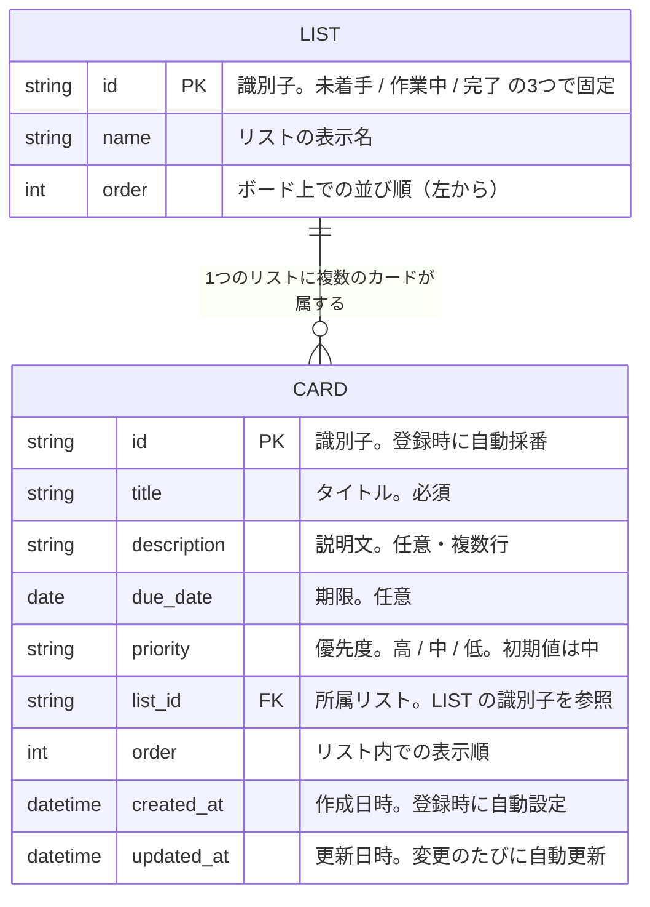
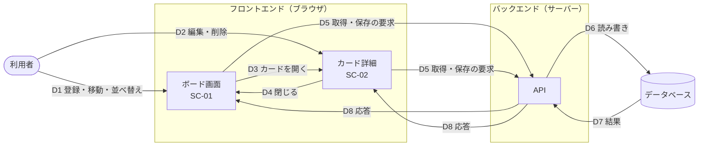

# タスク管理アプリ データ要件書

## 1. 文書情報

| 項目 | 内容 |
| --- | --- |
| 文書名 | タスク管理アプリ データ要件書 |
| 版数 | 1.2 |
| 作成日 | 2026-09-13 |
| 最終更新日 | 2026-09-19 |
| 作成者 | KeiT0773 |
| ステータス | 確定 |
| 上位文書 | [要件定義書](requirements.md) |
| 関連文書 | [機能要件書](functional-requirements.md)、[画面要件書](screen-requirements.md) |
| 下位文書 | [データ設計書](data-design.md) |

本書は、本システムがデータベースに保持すべき情報と、その構造・流れを定義する。具体的な格納形式（テーブル定義、型、桁数）は基本設計で決定し、[データ設計書](data-design.md)に定義する。各項目に関連する機能（FR-xx）の内容は [機能要件書](functional-requirements.md) を、画面（SC-xx）は [画面要件書](screen-requirements.md) を参照すること。

### 1.1 変更履歴

| 版数 | 日付 | 変更内容 | 変更者 |
| --- | --- | --- | --- |
| 1.0 | 2026-09-13 | 要件定義書 v2.0 の「8. データ要件」を分離し、独立した文書として作成 | KeiT0773 |
| 1.1 | 2026-09-13 | 画面モックでの確認結果を反映。「優先度」を登録時に指定可能に、「表示順」の変化要因にカード登録・優先度変更を追加。「所属リスト」の登録時の値を「未着手」固定から「登録操作を行った列」に修正 | KeiT0773 |
| 1.2 | 2026-09-19 | 本書をもとに[データ設計書](data-design.md)を作成したことに伴い、文書情報に下位文書へのリンクを追加 | KeiT0773 |

---

## 2. カードが持つ情報

| 項目 | 種別 | 設定者 | 必須/任意 | 説明 |
| --- | --- | --- | --- | --- |
| 識別子 | 文字列 | システム | 必須 | カードを一意に識別するための値。登録時に自動で採番する |
| タイトル | 文字列 | 利用者 | 必須 | カード上に表示されるタスク名。空欄では登録できない（FR-01） |
| 説明文 | 文字列（複数行） | 利用者 | 任意 | タスクの補足説明。未入力を許容する（FR-06） |
| 期限 | 日付 | 利用者 | 任意 | 完了すべき日付。未設定を許容する（FR-07） |
| 優先度 | 区分（高／中／低） | 利用者 | 必須 | 登録時に利用者が指定する。指定しない場合はシステムが「中」を設定する（FR-01, FR-08） |
| 所属リスト | 区分（未着手／作業中／完了） | システム | 必須 | そのカードが現在属している列。登録時は登録操作を行った列とし、移動により変化する（FR-01, FR-04） |
| 表示順 | 数値 | システム | 必須 | リスト内での並び順。ドラッグによる並べ替えのほか、カード登録・優先度変更後の優先度順並べ替えでも変化する（FR-01, FR-05, FR-08） |
| 作成日時 | 日時 | システム | 必須 | カードが登録された日時。登録時に自動で設定する |
| 更新日時 | 日時 | システム | 必須 | カードが最後に変更された日時。登録・編集・移動のたびに自動で更新する |

**凡例**

- **必須**：常に値が入っている必要がある項目。
- **任意**：値が空のままでもよい項目。空の場合に画面上で何を表示するかは、設計工程で定める。
- **設定者**：その値を誰が決めるかを示す。「利用者」は画面から入力する項目、「システム」は利用者の操作に応じて自動的に設定される項目を指す。

---

## 3. リストが持つ情報

リストは「未着手」「作業中」「完了」の3つで固定とし、利用者による変更は行わない（[要件定義書](requirements.md) 決定事項 No.1）。そのため、リストの情報はデータベースに初期データとして登録し、以後は変更しない。

---

## 4. ER図（データの構造）

データベースに保管する情報のかたまり（エンティティ）と、その関係を示す。基本設計では、この図をもとにテーブル定義を作成する。

| 図中の名称 | 本書での用語 | 説明 |
| --- | --- | --- |
| LIST | リスト（列） | 3件で固定。利用者は追加・削除・変更できない（3.） |
| CARD | カード | 利用者が登録するタスク1件。項目の詳細は 2. のとおり |

- 線の記号 `||--o{` は「LIST 1件に対して CARD が 0件以上属する」ことを表す。カードが1枚もないリストも存在しうる。
- カードは必ずいずれか1つのリストに属する。リストに属さないカードは存在しない。
- `PK` はそのエンティティを一意に識別する項目、`FK` は他のエンティティを参照する項目を示す。

---

## 5. データフロー図（データの流れ）

利用者の操作によって、データが3つの層（フロントエンド・バックエンド・データベース。[要件定義書](requirements.md)「2.4 システム構成」参照）の間をどう流れるかを示す。

| No | 流れ | 内容 | 関連機能 |
| --- | --- | --- | --- |
| D1 | 利用者 → ボード画面 | カードの登録、列の間の移動、列内の並べ替え | FR-01, FR-04, FR-05 |
| D2 | 利用者 → カード詳細 | タイトル・説明文・期限・優先度の編集、カードの削除 | FR-02, FR-03, FR-06, FR-07, FR-08 |
| D3 | ボード画面 → カード詳細 | カードをクリックし、そのカードの内容を詳細画面に表示する | SC-02 |
| D4 | カード詳細 → ボード画面 | 詳細画面を閉じ、編集結果をボード画面に反映する | SC-01 |
| D5 | フロントエンド → バックエンド | アプリを開いたときの「全カードの取得」要求と、D1・D2 の操作のたびに発生する「登録・更新・削除」要求を API 経由で送る | FR-09 |
| D6 | バックエンド → データベース | 要求内容を検証し、データベースを読み書きする | FR-09 |
| D7 | データベース → バックエンド | 読み書きの結果（取得したカード、保存の成否）を返す | FR-09 |
| D8 | バックエンド → フロントエンド | 結果を画面に返す。取得時はカード一覧を、保存時は成否を返し、失敗した場合は画面が利用者に通知する | FR-09 |

- 利用者・フロントエンドがデータベースに直接触れることはなく、必ずバックエンドの API を経由する（[要件定義書](requirements.md)「7. 非機能要件」データ保護）。
- API の具体的な仕様（要求・応答の形式、一覧）は基本設計で定める。
