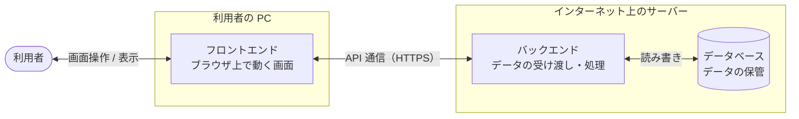
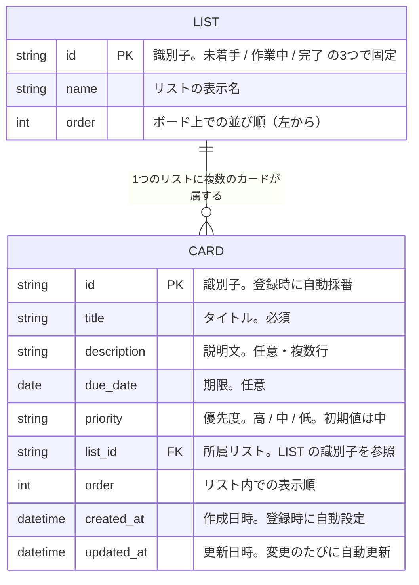
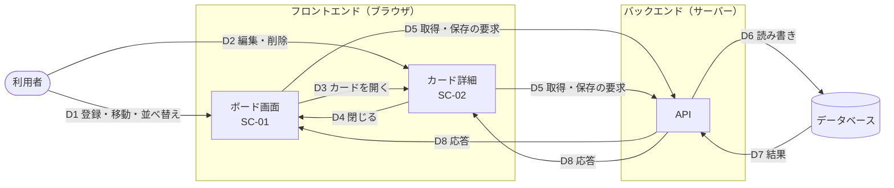

# タスク管理アプリ 要件定義書

## 1. 文書情報

| 項目 | 内容 |
| --- | --- |
| 文書名 | タスク管理アプリ 要件定義書 |
| 版数 | 2.0 |
| 作成日 | 2026-09-12 |
| 最終更新日 | 2026-09-13 |
| 作成者 | KeiT0773 |
| ステータス | 確定（レビュー反映済み） |

### 1.1 変更履歴

| 版数 | 日付 | 変更内容 | 変更者 |
| --- | --- | --- | --- |
| 1.0 | 2026-09-12 | 初版作成 | KeiT0773 |
| 1.1〜1.3 | 2026-09-12 | レビュー指摘の反映。決定事項 No.1〜6 を確定 | KeiT0773 |
| 1.4 | 2026-09-13 | 顧客説明用に補強。現状の課題（2.2）、利用シナリオ（5.2）、画面イメージ（6.3）、ER図・データフロー図（8.3, 8.4）、受け入れ基準（12）、変更履歴（1.1）を追加 | KeiT0773 |
| 2.0 | 2026-09-13 | システム構成を「ブラウザ内完結」から「フロントエンド＋バックエンド＋データベースの3層構成」に変更。これに伴い 2.2〜2.4、3、4、5、FR-09、7、8、9、10、11、12 を改訂 | KeiT0773 |

---

## 2. プロジェクト概要

### 2.1 背景・目的

日々の作業や学習のタスクを、紙やメモアプリではなく「視覚的に進捗が分かる形」で管理したい。Trello に代表されるカンバン方式は、タスクを「未着手 / 作業中 / 完了」の列に並べることで、全体の進み具合をひと目で把握できる。本プロジェクトでは、その仕組みを個人利用向けに最小限の機能で実装する。

あわせて、Web アプリケーション開発の一連の流れ（要件定義 → 設計 → 実装）を実践的に学ぶことも本プロジェクトの目的とする。

### 2.2 現状の課題と解決方針

現在はタスクを紙のメモやメモアプリで管理しているが、以下の課題がある。本システムでは、それぞれの課題を次の機能で解決する。

| No | 現状の課題 | 本システムでの解決方針 | 関連機能 |
| --- | --- | --- | --- |
| 1 | タスクが「まだ手を付けていないのか」「作業中なのか」「終わったのか」を一覧で把握できず、全体の進み具合が分からない | 状態ごとの3つの列にカードを並べ、ボード全体を見るだけで進捗が分かるようにする | SC-01, FR-04 |
| 2 | タスクの状態が変わるたびに、メモを書き直したり行を移動したりする手間がかかる | カードをドラッグ&ドロップで列の間を移動させるだけで状態を変えられるようにする | FR-04, FR-05 |
| 3 | 何から手を付けるべきかが、メモを読み返さないと判断できない | カードに優先度と期限を表示し、一覧を見ただけで着手順を判断できるようにする | FR-07, FR-08 |
| 4 | 期限を過ぎたタスクがあっても気付きにくい | 期限を過ぎたカードを他と区別して表示し、見落としを防ぐ | FR-07 |
| 5 | タスクの補足情報（何をどこまでやるか等）が別の場所に散らばり、探すのに時間がかかる | カードごとに説明文を持たせ、タスクと補足情報を1か所にまとめる | FR-06 |
| 6 | メモアプリを閉じたり端末を再起動したりすると、記録した内容を見失うことがある。また、端末を変えると同じ内容を見られない | 操作のたびにサーバー上のデータベースへ自動保存し、次回開いたときに前回の状態を復元する。どの端末のブラウザからでも同じデータを参照できる | FR-09 |

### 2.3 システムの概要

ブラウザ上で動作する、1人用のカンバン方式タスク管理アプリケーション。ユーザーはタスクを「カード」として登録し、ドラッグ&ドロップで列の間を移動させることで進捗を管理する。登録したデータはインターネット上のサーバーにあるデータベースに保存され、ページを閉じても失われない。また、同じ URL にアクセスすれば、別の端末やブラウザからも同じデータを参照・操作できる。

### 2.4 システム構成

本システムは、役割の異なる3つの層で構成する（3層構成）。



| 層 | 役割 | 動作する場所 |
| --- | --- | --- |
| フロントエンド | 利用者が操作する画面。カードの表示、ドラッグ&ドロップ、入力の受け付けを担当し、操作内容をバックエンドに送る | 利用者の PC のブラウザ |
| バックエンド | フロントエンドからの要求（取得・登録・更新・削除）を受け取り、内容を検証したうえでデータベースを読み書きし、結果を返す | インターネット上のサーバー |
| データベース | カードとリストのデータを永続的に保管する。利用者やフロントエンドから直接は触れず、必ずバックエンドを経由する | インターネット上のサーバー |

- フロントエンドとバックエンドの間の通信は、インターネットを経由するため暗号化（HTTPS）する。
- 各層で使用する技術（プログラミング言語、フレームワーク、データベース製品）は基本設計で決定する。
- サーバーの具体的な配置先（クラウドサービス等）も基本設計で決定する。

---

## 3. 用語定義

| 用語 | 定義 |
| --- | --- |
| ボード | アプリ全体の作業領域。複数のリストを横に並べて表示する画面そのものを指す。 |
| リスト（列） | ボード上に縦方向に並ぶタスクの入れ物。本システムでは「未着手」「作業中」「完了」の3つを指す。 |
| カード | 1件のタスクを表す単位。リストの中に縦に積み重なって表示される。 |
| 優先度 | そのタスクにどれだけ早く着手すべきかを示す区分。 |
| 期限 | そのタスクを完了させるべき日付。 |
| フロントエンド | 利用者のブラウザ上で動作する画面側のプログラム。 |
| バックエンド | サーバー上で動作し、フロントエンドからの要求を受けてデータベースを読み書きするプログラム。 |
| データベース（DB） | サーバー上でデータを永続的に保管する仕組み。 |
| API | フロントエンドとバックエンドがデータをやり取りするための取り決め（窓口）。 |

---

## 4. スコープ

### 4.1 対象範囲

本システムで実装するのは以下の3つとする。機能の詳細は「6. 機能要件」に定義する。

- **フロントエンド**：単一のボードにおけるカードの登録・編集・移動を行う画面
- **バックエンド**：フロントエンドからの要求を受けてカードのデータを取得・登録・更新・削除する API
- **データベース**：カードとリストのデータを保管する仕組み

### 4.2 対象外

以下は本バージョンでは実装しない。将来的な拡張候補として「10. 今後の拡張候補」に記載する。

- 複数ユーザーでの利用、および利用者ごとのログイン機能
- 複数人による同時編集・データ共有
- リスト（列）自体の追加・削除・名称変更
- 複数ボードの作成・切り替え
- サーバーの監視・自動復旧などの運用機能

---

## 5. 想定利用者・利用シーン

### 5.1 想定利用者

| 項目 | 内容 |
| --- | --- |
| 想定利用者 | 個人（1名）。自分のタスクを自分だけで管理する。 |
| 想定端末 | Windows 11 の PC。デスクトップブラウザでの利用を前提とする。 |
| 利用環境 | インターネットに接続できる環境。サーバーと通信するため、接続がない状態では利用できない。 |
| 利用シーン | 作業開始時にその日のタスクを登録し、着手したカードを「作業中」へ、終わったカードを「完了」へ移動させながら1日を通して参照する。 |
| 想定データ量 | 1ボードあたり最大100件程度のカード。 |
| 同時利用 | 利用者は1名のため、複数のブラウザから同時に操作することは想定しない。 |

### 5.2 利用シナリオ

利用者の1日の使い方を、画面と機能に対応させて示す。

| 時点 | 利用者の行動 | システムの動き | 画面 | 関連機能 |
| --- | --- | --- | --- | --- |
| 朝・作業開始時 | ブラウザでアプリの URL を開く | サーバーから最新のデータを取得し、前日終了時点のボードをそのまま表示する | SC-01 | FR-09 |
| 〃 | 今日やることを「未着手」列に1件ずつ登録する | タイトルを入力するとカードが列の末尾に追加される | SC-01 | FR-01 |
| 〃 | 重要なタスクのカードを開き、優先度を「高」にする。締切のあるものには期限を入れる | カード表面に優先度の色と期限が表示される | SC-02 | FR-07, FR-08 |
| 〃 | 着手する順にカードを並べ替える | 列内の表示順が入れ替わる | SC-01 | FR-05 |
| 日中・作業中 | 手を付けたタスクのカードを「作業中」列へドラッグする | カードが「作業中」列に移り、その状態がサーバーに保存される | SC-01 | FR-04, FR-09 |
| 〃 | 作業の途中で分かったこと（参照先、残作業など）をカードの説明文に書き留める | 説明文がサーバーに保存され、次にカードを開いたときに表示される | SC-02 | FR-06 |
| 〃 | 終わったタスクのカードを「完了」列へドラッグする | カードが「完了」列に移り、その状態がサーバーに保存される | SC-01 | FR-04, FR-09 |
| 〃 | 別の PC に移動し、そのブラウザで同じ URL を開く | 直前まで使っていた PC と同じ状態のボードが表示される | SC-01 | FR-09 |
| 夕方・作業終了時 | 「完了」列を見て、今日終わったことを振り返る | ― | SC-01 | ― |
| 〃 | 「未着手」列に残ったカードのうち、期限を過ぎて強調表示されているものを確認し、明日の優先度を見直す | 期限を過ぎたカードが他と区別して表示されている | SC-01, SC-02 | FR-07, FR-08 |
| 〃 | やらなくなったタスクのカードを削除する | カードが即座に消え、その状態がサーバーに保存される | SC-02 | FR-03, FR-09 |
| 〃 | ブラウザを閉じる | すべてサーバーに保存済みのため、特別な操作は不要 | ― | FR-09 |

---

## 6. 機能要件

### 6.1 機能一覧

| ID | 機能名 | 概要 | 優先度 |
| --- | --- | --- | --- |
| FR-01 | カード登録 | 新しいタスクをカードとして追加する | 必須 |
| FR-02 | カード編集 | 既存カードのタイトルを変更する | 必須 |
| FR-03 | カード削除 | 不要になったカードを削除する | 必須 |
| FR-04 | カード移動 | カードを別のリストへドラッグ&ドロップで移動する | 必須 |
| FR-05 | カード並べ替え | 同一リスト内でカードの表示順を入れ替える | 必須 |
| FR-06 | 説明文の登録 | カードに補足説明を記録する | 必須 |
| FR-07 | 期限の設定 | カードに完了すべき日付を設定する | 必須 |
| FR-08 | 優先度の設定 | カードに優先度を設定し、一覧上で識別できるようにする | 必須 |
| FR-09 | データ保存 | 登録内容をサーバー上のデータベースに保存し、再訪時に復元する | 必須 |

### 6.2 機能詳細

#### FR-01 カード登録

各リストの下部に配置された追加ボタンから、新しいカードを作成できること。作成時にはタイトルの入力を必須とし、タイトルが空のまま登録しようとした場合は登録を行わない。説明文・期限・優先度は登録時点では未設定でよく、後から設定できること。優先度の初期値は「中」とする。

#### FR-02 カード編集

登録済みカードのタイトルを変更できること。変更内容は即座に画面へ反映され、保存されること。

#### FR-03 カード削除

登録済みカードを削除できること。操作の手数を優先し、削除前の確認は求めない。削除したカードを元に戻す手段は本バージョンでは提供しないため、削除ボタンは誤って押しにくい配置とすること。

#### FR-04 カード移動

カードをマウスでドラッグし、別のリスト上でドロップすることで、そのリストへ移動できること。ドラッグ中はカードが移動先のどこに挿入されるかを視覚的に示すこと。移動結果は保存され、再訪時にも維持されること。

#### FR-05 カード並べ替え

同一リスト内でカードを上下にドラッグし、表示順を入れ替えられること。並べ替えた順序は保存されること。

#### FR-06 説明文の登録

カードごとに、タスクの内容を補足する文章を1件記録できること。複数行の入力に対応する。説明文は任意項目とし、未入力でも差し支えないこと。

#### FR-07 期限の設定

カードごとに完了すべき日付を1つ設定できること。任意項目とする。設定された期限はカード上に表示され、期限を過ぎているカードは他と区別できる表示とすること。

#### FR-08 優先度の設定

カードごとに「高 / 中 / 低」の3段階から優先度を1つ設定できること。優先度はカード上に色付きの表示で示し、一覧を見た際に区別できるようにすること。

#### FR-09 データ保存

登録・編集・移動・削除のすべての操作結果を、操作の都度バックエンド経由でデータベースに保存すること。次回アプリを開いた際には、データベースから最新の状態を取得して表示すること。これにより、別の端末やブラウザからアクセスした場合でも同じ状態が表示されること。

サーバーと通信できない場合（ネットワーク未接続、サーバー停止など）は、操作が保存されていないことを利用者に分かるように通知すること。通知の方法や再試行の仕組みは基本設計で定める。

### 6.3 画面要件

#### 画面一覧

| ID | 画面名 | 役割 |
| --- | --- | --- |
| SC-01 | ボード画面 | メイン画面。3つのリストとカードを一覧表示し、カードの追加・移動・並べ替えを行う |
| SC-02 | カード詳細 | 1枚のカードの説明文・期限・優先度を確認・編集する。ボード画面から呼び出す |

#### 画面構成の要件

- ボード画面では「未着手」「作業中」「完了」の3つのリストを横に並べて表示し、スクロールせずに同時に見渡せること。
- 各リストの中では、カードを表示順に従って縦に並べること。
- カードの表面には、詳細を開かなくてもタイトル・優先度・期限が読み取れること。説明文はカード詳細でのみ表示する。
- 各リストに、そのリストへカードを追加する操作を配置すること。
- カード詳細は、ボード画面の表示を保ったまま開閉できること（別ページへは遷移しない）。

#### 画面遷移

ボード画面（SC-01）とカード詳細（SC-02）の間の往復のみとする。他の画面は存在しない。

#### 画面イメージ

各画面の構成を以下に示す。要素の配置と表示項目を伝えるための概略であり、色・寸法・装飾は基本設計で定める。

**SC-01 ボード画面**

```
┌──────────────────────────────────────────────────────────────┐
│ タスク管理ボード                                             │
├────────────────────┬────────────────────┬────────────────────┤
│ 未着手             │ 作業中             │ 完了               │
├────────────────────┼────────────────────┼────────────────────┤
│ ┌────────────────┐ │ ┌────────────────┐ │ ┌────────────────┐ │
│ │ [高] 資料作成  │ │ │ [中] 実装      │ │ │ [低] 掃除      │ │
│ │ 期限 09/15     │ │ │ 期限 09/20     │ │ │                │ │
│ └────────────────┘ │ └────────────────┘ │ └────────────────┘ │
│ ┌────────────────┐ │                    │ ┌────────────────┐ │
│ │ [中] 買い物    │ │                    │ │ [中] 返信      │ │
│ │ 期限 09/10 (!) │ │                    │ │ 期限 09/11     │ │
│ └────────────────┘ │                    │ └────────────────┘ │
│ ┌────────────────┐ │                    │                    │
│ │ [低] 読書      │ │                    │                    │
│ │                │ │                    │                    │
│ └────────────────┘ │                    │                    │
│                    │                    │                    │
│ ＋ カードを追加    │ ＋ カードを追加    │ ＋ カードを追加    │
└────────────────────┴────────────────────┴────────────────────┘
```

- `[高] [中] [低]` は優先度を表す。実際の画面では色付きの表示とする（FR-08）。
- `(!)` は期限を過ぎているカードを表す。実際の画面では他と区別できる表示とする（FR-07）。
- 期限が未設定のカードは、期限の行を空欄とする。
- カードをクリックするとカード詳細（SC-02）が開く。
- カードはドラッグで列の間および列の中を移動できる（FR-04, FR-05）。
- 各列の下部の「＋ カードを追加」からカードを登録する（FR-01）。

**SC-02 カード詳細**

ボード画面の手前に重ねて表示し、閉じるとボード画面に戻る。

```
┌────────────────────────────────────────────┐
│ カード詳細                        [閉じる] │
├────────────────────────────────────────────┤
│ タイトル                                   │
│ ┌────────────────────────────────────────┐ │
│ │ 資料作成                               │ │
│ └────────────────────────────────────────┘ │
│ 説明文                                     │
│ ┌────────────────────────────────────────┐ │
│ │ 来週の定例会議で使う資料。             │ │
│ │ 前回の議事録を参照すること。           │ │
│ └────────────────────────────────────────┘ │
│ 期限               優先度                  │
│ ┌────────────┐     [ ] 高 [x] 中 [ ] 低    │
│ │ 2026/09/15 │                             │
│ └────────────┘                             │
│                                            │
│                           [ カードを削除 ] │
└────────────────────────────────────────────┘
```

- タイトル（FR-02）、説明文（FR-06）、期限（FR-07）、優先度（FR-08）をこの画面で編集する。
- 削除ボタン（FR-03）は、誤操作を防ぐためボード画面のカード表面には置かず、この画面の下部に配置する。
- 「閉じる」でボード画面に戻る。編集内容は閉じる前に保存されている（FR-09）。

---

## 7. 非機能要件

| 分類 | 要件 |
| --- | --- |
| 対応ブラウザ | Google Chrome および Microsoft Edge の最新版で正しく動作すること。 |
| 対応環境 | Windows 11 のデスクトップ環境。スマートフォン対応は本バージョンでは必須としない。 |
| 性能 | カード100件程度を表示した状態でも、ドラッグ操作が引っかかりなく行えること。操作結果がサーバーに保存されるまでの待ち時間が、利用者の操作を妨げないこと。 |
| 操作性 | 主要な操作（カードの追加・移動）は、説明を読まずに直感的に行えること。 |
| データ保管 | データはサーバー上のデータベースに保管し、利用者の端末やブラウザには依存しないこと。想定データ量（カード100件程度）を問題なく保管できること。 |
| 可用性 | サーバーが稼働している間は、インターネット経由でいつでも利用できること。ネットワーク未接続やサーバー停止中は利用できないが、その状態を利用者に通知すること（FR-09）。 |
| 通信の保護 | フロントエンドとバックエンドの間の通信は HTTPS で暗号化し、通信経路上で内容を盗み見られないこと。 |
| アクセス制御 | 認証機能は設けない。そのため、本システムの URL を知る第三者は誰でもデータを閲覧・変更できる。この前提のもと、機密情報の登録は想定せず、URL は利用者本人以外に公開しない運用とする。 |
| データ保護 | サーバー側のデータベースは、インターネットから直接アクセスできない構成とし、必ずバックエンドを経由すること。 |

---

## 8. データ要件

本システムがデータベースに保持すべき情報を以下に定義する。具体的な格納形式（テーブル定義、型、桁数）は基本設計で決定する。

### 8.1 カードが持つ情報

| 項目 | 種別 | 設定者 | 必須/任意 | 説明 |
| --- | --- | --- | --- | --- |
| 識別子 | 文字列 | システム | 必須 | カードを一意に識別するための値。登録時に自動で採番する |
| タイトル | 文字列 | 利用者 | 必須 | カード上に表示されるタスク名。空欄では登録できない（FR-01） |
| 説明文 | 文字列（複数行） | 利用者 | 任意 | タスクの補足説明。未入力を許容する（FR-06） |
| 期限 | 日付 | 利用者 | 任意 | 完了すべき日付。未設定を許容する（FR-07） |
| 優先度 | 区分（高／中／低） | 利用者 | 必須 | 利用者が指定しない場合はシステムが「中」を設定する（FR-08） |
| 所属リスト | 区分（未着手／作業中／完了） | システム | 必須 | そのカードが現在属している列。登録時は「未着手」とし、移動により変化する（FR-04） |
| 表示順 | 数値 | システム | 必須 | リスト内での並び順。並べ替えにより変化する（FR-05） |
| 作成日時 | 日時 | システム | 必須 | カードが登録された日時。登録時に自動で設定する |
| 更新日時 | 日時 | システム | 必須 | カードが最後に変更された日時。登録・編集・移動のたびに自動で更新する |

**凡例**

- **必須**：常に値が入っている必要がある項目。
- **任意**：値が空のままでもよい項目。空の場合に画面上で何を表示するかは、設計工程で定める。
- **設定者**：その値を誰が決めるかを示す。「利用者」は画面から入力する項目、「システム」は利用者の操作に応じて自動的に設定される項目を指す。

### 8.2 リストが持つ情報

リストは「未着手」「作業中」「完了」の3つで固定とし、利用者による変更は行わない。そのため、リストの情報はデータベースに初期データとして登録し、以後は変更しない。

### 8.3 ER図（データの構造）

データベースに保管する情報のかたまり（エンティティ）と、その関係を示す。基本設計では、この図をもとにテーブル定義を作成する。



| 図中の名称 | 本書での用語 | 説明 |
| --- | --- | --- |
| LIST | リスト（列） | 3件で固定。利用者は追加・削除・変更できない（8.2） |
| CARD | カード | 利用者が登録するタスク1件。項目の詳細は 8.1 のとおり |

- 線の記号 `||--o{` は「LIST 1件に対して CARD が 0件以上属する」ことを表す。カードが1枚もないリストも存在しうる。
- カードは必ずいずれか1つのリストに属する。リストに属さないカードは存在しない。
- `PK` はそのエンティティを一意に識別する項目、`FK` は他のエンティティを参照する項目を示す。

### 8.4 データフロー図（データの流れ）

利用者の操作によって、データが3つの層の間をどう流れるかを示す。



| No | 流れ | 内容 | 関連機能 |
| --- | --- | --- | --- |
| D1 | 利用者 → ボード画面 | カードの登録、列の間の移動、列内の並べ替え | FR-01, FR-04, FR-05 |
| D2 | 利用者 → カード詳細 | タイトル・説明文・期限・優先度の編集、カードの削除 | FR-02, FR-03, FR-06, FR-07, FR-08 |
| D3 | ボード画面 → カード詳細 | カードをクリックし、そのカードの内容を詳細画面に表示する | SC-02 |
| D4 | カード詳細 → ボード画面 | 詳細画面を閉じ、編集結果をボード画面に反映する | SC-01 |
| D5 | フロントエンド → バックエンド | アプリを開いたときの「全カードの取得」要求と、D1・D2 の操作のたびに発生する「登録・更新・削除」要求を API 経由で送る | FR-09 |
| D6 | バックエンド → データベース | 要求内容を検証し、データベースを読み書きする | FR-09 |
| D7 | データベース → バックエンド | 読み書きの結果（取得したカード、保存の成否）を返す | FR-09 |
| D8 | バックエンド → フロントエンド | 結果を画面に返す。取得時はカード一覧を、保存時は成否を返し、失敗した場合は画面が利用者に通知する | FR-09 |

- 利用者・フロントエンドがデータベースに直接触れることはなく、必ずバックエンドの API を経由する（7. 非機能要件「データ保護」）。
- API の具体的な仕様（要求・応答の形式、一覧）は基本設計で定める。

---

## 9. 制約事項

- インターネットに接続していない環境では利用できない。
- サーバーが停止している間は利用できない。サーバーの監視や自動復旧は本バージョンの対象外とする（4.2）。
- 認証機能がないため、本システムの URL を知る第三者は誰でもデータを閲覧・変更できる（7. 非機能要件「アクセス制御」）。
- サーバーの運用にかかる費用（サーバー利用料、ドメイン等）は本書の対象外とし、別途見積もる。
- バックアップ機能およびデータの書き出し機能は本バージョンでは提供しない。
- カードの削除は即時に確定し、取り消し（アンドゥ）はできない（FR-03）。

---

## 10. 今後の拡張候補

本バージョンでは実装しないが、将来的に検討しうる機能を以下に挙げる。

| 分類 | 機能 |
| --- | --- |
| リスト操作 | 列の追加・名称変更・削除・並べ替え |
| カード詳細 | ラベル（タグ）、チェックリスト、担当者、コメント、ファイル添付 |
| 全体機能 | キーワード検索・絞り込み、複数ボードの切り替え |
| アクセス制限 | 簡易的なパスワード保護、ログイン機能 |
| 共同利用 | 複数人でのリアルタイム共同編集 |
| データ | バックアップ、CSV などへの書き出し |
| 運用 | サーバーの監視、障害時の自動復旧 |

---

## 11. 決定事項

要件のレビューを経て確定した事項を以下に記録する。

| No | 決定内容 | 関連 | 決定日 |
| --- | --- | --- | --- |
| 1 | リストは「未着手 / 作業中 / 完了」の3つで固定とし、利用者による増減は行わない | 4.2, 8.2 | 2026-09-12 |
| 2 | 優先度は「高 / 中 / 低」の3段階とする | FR-08 | 2026-09-12 |
| 3 | 期限を過ぎたカードは、表示を変えて目立たせる | FR-07 | 2026-09-12 |
| 4 | カード削除時の確認ダイアログは設けない。操作の手数を優先する | FR-03 | 2026-09-12 |
| 5 | スマートフォンでの利用は本バージョンでは考慮しない | 7 | 2026-09-12 |
| 6 | 扱うボードは1つとし、複数ボードの切り替えは行わない | 4.2 | 2026-09-12 |
| 7 | システムはフロントエンド・バックエンド・データベースの3層構成とし、データはサーバー上のデータベースに保存する | 2.4, FR-09 | 2026-09-13 |
| 8 | バックエンドとデータベースはインターネット上のサーバーに配置する。具体的な配置先は基本設計で決める | 2.4 | 2026-09-13 |
| 9 | ログイン機能は設けない。URL を知る第三者がデータにアクセスできるリスクは、機密情報を登録しない・URL を公開しない運用で受容する | 7, 9 | 2026-09-13 |

---

## 12. 受け入れ基準

本システムが要件を満たしているかを判断する基準を以下に定める。すべての項目が合格条件を満たした時点で、本システムは完成とみなす。確認は「7. 非機能要件」に定めた対応ブラウザで行う。

### 12.1 機能要件

| 対象 | 確認方法 | 合格条件 |
| --- | --- | --- |
| FR-01 | 「未着手」列の追加操作からタイトルを入力して登録する | カードが「未着手」列の末尾に表示され、優先度が「中」になっている |
| FR-01 | タイトルを空のまま登録操作を行う | カードが追加されない |
| FR-02 | 既存カードのタイトルを変更する | 変更が即座にボード画面に反映される。ページを再読み込みしても変更後のタイトルが表示される |
| FR-03 | カードを削除する | 確認を求められることなくカードが消える。ページを再読み込みしても復活しない |
| FR-04 | カードを「未着手」列から「作業中」列へドラッグ&ドロップする | ドラッグ中に挿入位置が視覚的に示される。ドロップ後、カードが「作業中」列に表示される。ページを再読み込みしても「作業中」列にある |
| FR-05 | 同じ列の中でカードを上下にドラッグして順序を入れ替える | 表示順が入れ替わる。ページを再読み込みしても入れ替え後の順序が維持される |
| FR-06 | カード詳細で複数行の説明文を入力し、閉じてから再度開く | 入力した説明文が改行を保ったまま表示される。ボード画面のカード表面には説明文が表示されない |
| FR-06 | 説明文を空のままカード詳細を閉じる | エラーにならず、カードは正常に扱える |
| FR-07 | カードに期限を設定する | カード表面に期限が表示される |
| FR-07 | 期限を過ぎたカードと過ぎていないカードを並べて表示する | 期限を過ぎたカードが、他のカードと見分けられる表示になっている（判定基準は基本設計で定める） |
| FR-07 | 期限を設定しないカードを表示する | エラーにならず、期限の表示が空欄になっている |
| FR-08 | 優先度「高」「中」「低」のカードを1枚ずつ作り、並べて表示する | 3枚のカードが、色によって互いに見分けられる |
| FR-09 | カードの登録・編集・移動・削除を行った後、ブラウザを完全に閉じてから再度アプリを開く | 閉じる直前と同じ状態（カードの内容・所属列・順序）が表示される |
| FR-09 | ある PC でカードを操作した後、別の PC（または別のブラウザ）で同じ URL を開く | 操作した PC と同じ状態が表示される |
| FR-09 | ネットワークを切断した状態でカードを操作する | 操作が保存されなかったことが画面上で利用者に通知される |

### 12.2 画面要件

| 対象 | 確認方法 | 合格条件 |
| --- | --- | --- |
| SC-01 | 想定端末のブラウザでボード画面を開く | 「未着手」「作業中」「完了」の3列が横に並び、横スクロールなしで同時に見える |
| SC-01 | カードを表示する | 詳細を開かなくても、カード表面でタイトル・優先度・期限が読み取れる |
| SC-02 | ボード画面からカード詳細を開く | ボード画面が背後に残ったまま、カード詳細が手前に表示される。閉じるとボード画面に戻り、別ページへは遷移しない |

### 12.3 非機能要件

| 対象 | 確認方法 | 合格条件 |
| --- | --- | --- |
| 性能 | カードを100件登録した状態で、カードをドラッグする | ドラッグ中のカードがマウスの動きに追従し、ドロップ後1秒以内に配置が確定する |
| 性能 | カードを100件登録した状態で、アプリを開く | 3秒以内にボード画面にすべてのカードが表示される |
| 操作性 | 本システムの説明を受けていない人に、口頭の案内なしで「カードを1枚追加し、別の列へ移動する」操作を依頼する | 3分以内に操作を完了できる |
| データ保管 | カードを100件登録し、各カードに説明文を入力する | 保存に失敗せず、再読み込み後もすべてのカードが復元される |
| 可用性 | サーバーが稼働している状態で、時間帯を変えて複数回アプリを開く | いずれの回もボード画面が表示され、操作できる |
| 可用性 | サーバーを停止した状態でアプリを開く、またはカードを操作する | サーバーと通信できないことが画面上で利用者に通知される |
| 通信の保護 | ブラウザのアドレスバーと開発者ツールで、フロントエンドとバックエンドの間の通信を観察する | すべての通信が HTTPS で行われている |
| データ保護 | インターネット上からデータベースへ直接接続を試みる | 接続できない |
